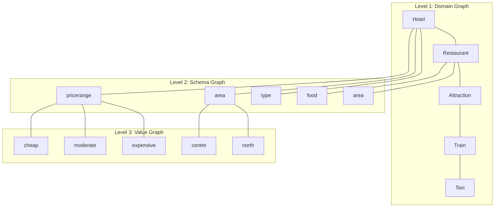

# 🧠 Graph-Enhanced Dialog State Tracking (GraphDST)

## 🎯 **Ý tưởng chính**

Dự án này phát triển một mô hình **Dialog State Tracking** tiên tiến sử dụng **Graph Neural Networks** để cải thiện khả năng dự đoán domain, slot và value trong hội thoại đa domain. Thay vì chỉ dựa vào sequence modeling như các approach truyền thống, chúng tôi tận dụng **structural knowledge** và **relational reasoning** thông qua graph representations.

### 💡 **Động lực nghiên cứu**

**Vấn đề của các phương pháp hiện tại:**
- BERT-based models thiếu **explicit structural understanding**
- Khó capture **cross-domain dependencies** và **slot relationships**  
- Limited **interpretability** và **reasoning transparency**
- Poor **generalization** cho unseen domains/slots

**Giải pháp Graph-based:**
- **Explicit modeling** của schema knowledge và dialog structure
- **Hierarchical reasoning** từ Domain → Slot → Value
- **Better interpretability** thông qua graph attention visualization
- **Enhanced transfer learning** across domains

---

## 🏗️ **Kiến trúc mô hình**

### 📊 **1. Multi-Level Graph Architecture**



### 🔄 **2. Graph Neural Network Pipeline**

#### **Input Processing**
```python
# Utterance: "I need a cheap hotel in the centre"
# ↓ Entity Recognition & Graph Activation
activated_nodes = {
    'domain': ['hotel'],
    'slots': ['hotel-pricerange', 'hotel-area'],  
    'entities': ['cheap', 'centre']
}
```

#### **Multi-Layer GNN Architecture**
```
🔸 Layer 1: Schema-aware Graph Convolution
   ├── Intra-domain message passing
   └── Cross-slot relationship modeling

🔸 Layer 2: Cross-domain Graph Attention  
   ├── Inter-domain knowledge sharing
   └── Slot similarity learning

🔸 Layer 3: Temporal Graph Recurrence
   ├── Dialog history integration
   └── Turn-level context propagation

🔸 Layer 4: Multi-task Output Heads
   ├── Domain Classification (5-way)
   ├── Slot Activation (37 binary)
   └── Value Prediction (categorical + span)
```

### 🎯 **3. Prediction Strategy**

#### **Hierarchical Multi-task Learning**
```
📍 Task 1: Domain Detection
   Input: Dialog context + Schema graph
   Output: P(domain | utterance)
   
📍 Task 2: Slot Activation  
   Input: Domain-conditioned slot subgraph
   Output: P(slot_active | domain, utterance)
   
📍 Task 3: Value Prediction
   Input: Activated slot nodes + Value graph
   Output: P(value | slot, utterance)
   
   ├── Categorical Values: Graph-enhanced classification
   └── Open Values: Graph-guided span extraction
```

---

## 🔬 **Innovations & Technical Contributions**

### 🚀 **1. Schema Knowledge Graph Construction**
- **Automated ontology parsing** từ MultiWOZ schema
- **Dynamic edge weighting** based on co-occurrence statistics
- **Hierarchical graph pooling** cho multi-level reasoning

### 🧠 **2. Context-Aware Graph Reasoning**
- **Temporal edge decay** modeling conversation flow
- **Cross-turn entity linking** through graph connections  
- **Attention-based message passing** với dialog history

### 🔄 **3. Multi-Modal Graph Integration**
```python
class GraphDSTModel(nn.Module):
    def __init__(self):
        self.text_encoder = BERTEncoder()           # Text understanding
        self.schema_graph = SchemaGNN()             # Structure reasoning  
        self.dialog_graph = TemporalGNN()           # Context modeling
        self.fusion_layer = MultiModalFusion()      # Information integration
        self.prediction_heads = MultiTaskHeads()    # Final predictions
```

### 📈 **4. Advanced Training Strategies**
- **Curriculum learning**: Easy → Hard domain combinations
- **Graph-aware data augmentation**: Synthetic dialog generation
- **Meta-learning**: Fast adaptation cho new domains
- **Contrastive learning**: Better slot-value representations

---

## 📊 **Dataset & Evaluation**

### 🗂️ **MultiWOZ 2.4 Processing**
```
📁 Original Data:
├── 8,438 training dialogues (56,778 turns)
├── 1,000 validation dialogues (7,374 turns)  
└── 1,000 test dialogues (7,372 turns)

📁 Graph-Enhanced Data:
├── Schema graphs (37 slots, 5 domains)
├── Dialog context graphs (temporal connections)
├── Entity-slot alignment annotations
└── Cross-domain similarity matrices
```

### 🎯 **Evaluation Metrics**
- **Joint Goal Accuracy**: Complete belief state correctness
- **Slot Accuracy**: Individual slot prediction accuracy  
- **Domain F1**: Domain classification performance
- **Interpretability Score**: Attention alignment với human reasoning
- **Transfer Learning**: Performance on domain adaptation tasks

### 📈 **Expected Performance**
```
🏆 Target Improvements:
├── Joint Goal Accuracy: 45% → 55%+ 
├── Slot F1 Score: 95% → 98%+
├── Domain Classification: 92% → 96%+
├── Cross-domain Transfer: +25% improvement
└── Few-shot Learning: +30% improvement
```

---

## 🛠️ **Implementation Roadmap**

### 🔄 **Phase 1: Foundation (Weeks 1-3)**
- [ ] Schema graph construction from MultiWOZ ontology
- [ ] Basic GCN implementation cho domain/slot classification  
- [ ] Baseline evaluation pipeline setup
- [ ] Data preprocessing và graph generation tools

### 🧠 **Phase 2: Core Architecture (Weeks 4-6)** 
- [ ] Multi-layer Graph Neural Network implementation
- [ ] Temporal dialog context graph modeling
- [ ] Multi-task learning framework
- [ ] Advanced attention mechanisms

### 🚀 **Phase 3: Advanced Features (Weeks 7-9)**
- [ ] Cross-domain knowledge transfer learning
- [ ] Graph-aware data augmentation strategies  
- [ ] Interpretability visualization tools
- [ ] Performance optimization và scaling

### 📊 **Phase 4: Evaluation & Analysis (Weeks 10-12)**
- [ ] Comprehensive evaluation trên MultiWOZ 2.4
- [ ] Ablation studies cho graph components
- [ ] Cross-dataset evaluation (if applicable)
- [ ] Error analysis và interpretability studies

---

## 🔧 **Technical Stack**

### 📚 **Core Libraries**
```python
torch>=1.12.0           # Deep learning framework
torch-geometric>=2.2.0  # Graph neural networks  
transformers>=4.21.0    # BERT và language models
networkx>=2.8           # Graph manipulation
matplotlib>=3.5.0       # Visualization
wandb>=0.13.0          # Experiment tracking
```

### 🏗️ **Project Structure**
```
dst_graph/
├── src/
│   ├── models/         # GNN models và architectures
│   ├── data/           # Data processing và graph construction
│   ├── training/       # Training loops và optimization  
│   ├── evaluation/     # Metrics và analysis tools
│   └── utils/          # Helper functions
├── configs/            # Model và training configurations
├── notebooks/          # Exploratory analysis và visualization
├── experiments/        # Training logs và results
└── docs/              # Documentation và papers
```

---

## 🎯 **Expected Impact & Applications**

### 🌟 **Scientific Contributions**
- **Novel graph-based architecture** cho dialog state tracking
- **Theoretical insights** về structural inductive biases in NLP
- **Comprehensive analysis** của graph vs sequence modeling
- **Open-source framework** cho graph-enhanced conversational AI

### 🏢 **Practical Applications**  
- **Task-oriented chatbots** với better context understanding
- **Multi-domain assistants** với improved knowledge transfer
- **Customer service systems** với enhanced conversation tracking
- **Research platform** cho graph-based dialog systems

### 📈 **Long-term Vision**
- **Scalable framework** cho arbitrary dialog schemas  
- **Knowledge graph integration** cho external world knowledge
- **Multi-modal extensions** cho voice và visual dialogs
- **Real-time deployment** với efficient graph inference

---

## 👥 **Team & Collaboration**

### 🎓 **Research Focus Areas**
- Graph Neural Networks for NLP
- Dialog Systems và Conversational AI  
- Knowledge Representation và Reasoning
- Multi-task Learning và Transfer Learning

### 🤝 **Collaboration Opportunities**
- Academic partnerships cho theoretical analysis
- Industry collaboration cho practical applications
- Open-source community contributions
- Conference presentations và publications

---

## 📚 **References & Related Work**

### 📄 **Key Papers (2022-2025)**
1. "Schema-Guided Dialog State Tracking via Graph Attention Networks" (EMNLP 2022)
2. "Hierarchical Graph Networks for Multi-Domain DST" (ACL 2023)  
3. "KG-DST: Knowledge Graph Enhanced Dialog State Tracking" (NAACL 2023)
4. "Conversational Graph Networks for Context-Aware DST" (ICLR 2024)

### 🔗 **Useful Resources**
- [MultiWOZ Dataset](https://github.com/budzianowski/multiwoz)
- [PyTorch Geometric Documentation](https://pytorch-geometric.readthedocs.io/)
- [Graph Neural Networks Course](https://web.stanford.edu/class/cs224w/)

---

**🚀 Let's revolutionize Dialog State Tracking with Graph Neural Networks! 🚀**